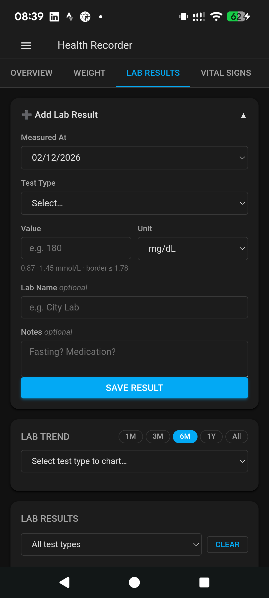
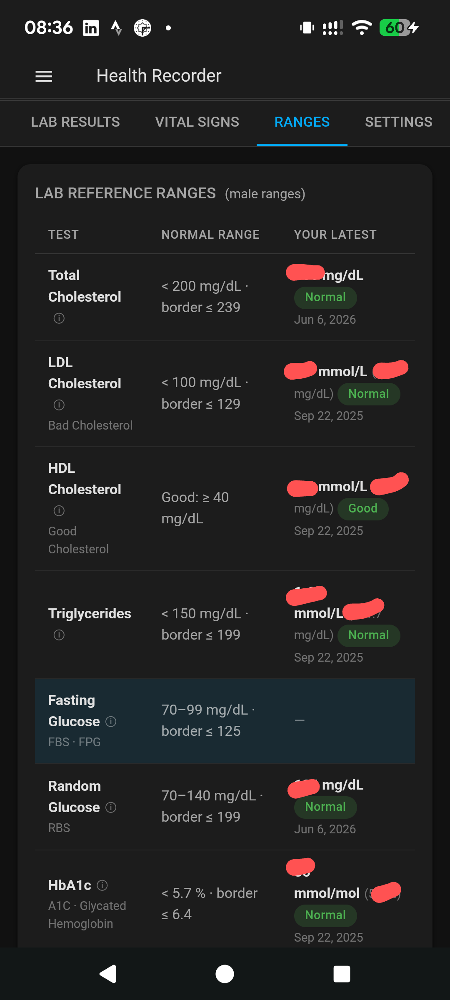

# 🫀 Health Recorder

[](LICENSE)

A personal health data recorder with Google Health and Google Sheets sync.

Available as a **Home Assistant addon** (sidebar panel, multi-user) or as a **standalone app** (Docker Compose).

---

## 🏠 Home Assistant Addon

The HA addon is the primary way to run Health Recorder. It appears as a **Health** panel in your HA sidebar and requires no separate server.

### Key features

- **Multi-user** — each HA user gets their own isolated data; authentication is automatic via HA's ingress (no login form)
- **Native look** — UI matches HA's color palette, Material card style, Roboto font, and dark mode
- **Sidebar panel** — accessible from anywhere in HA via ingress
- **Google sync** — optional Google Health + Sheets sync, per user
- **Persistent storage** — data lives at `/data/health_recorder.db`, survives addon updates

### Screenshots

<table>
<tr>
<td><br/><sub>Add Lab Result</sub></td>
<td><br/><sub>Reference Ranges tab</sub></td>
</tr>
</table>

### Installation

1. In Home Assistant go to **Settings → Add-ons → Add-on Store → ⋮ → Repositories**
2. Add: `https://github.com/nsaputro/health-recorder`
3. Find **Health Recorder** → **Install** → **Start**
4. The **Health** panel appears in your sidebar

Installation uses pre-built Docker images from
`ghcr.io/nsaputro/health-recorder/{amd64,aarch64}-health_recorder` — no local build needed.

### Google Sync (optional)

1. In [Google Cloud Console](https://console.cloud.google.com/), create an OAuth 2.0 Client ID (Web application) with redirect URI:
   ```
   http://<your-ha-ip>:8099/auth/google/callback
   ```
2. In the addon **Configuration** tab set `google_client_id`, `google_client_secret`, `google_redirect_uri`
3. Restart the addon, then open **Health → Settings → Connect Google Account**

### What syncs where

| Metric | Google Health | Google Sheets |
|--------|--------------|---------------|
| Body weight / BMI | ✅ | ✅ |
| Blood pressure | — ¹ | ✅ |
| Heart rate | ✅ | ✅ |
| Blood glucose | ✅ | ✅ |
| Cholesterol (LDL / HDL / Total) | — | ✅ |
| Triglycerides | — | ✅ |
| HbA1c | — | ✅ |
| Uric acid | — | ✅ |

¹ The Google Health API v4 has no blood pressure data type. Blood pressure is recorded locally and synced to Google Sheets only.

---

## 📊 Tracked Metrics

| Metric | Record | Chart | Google Health | Google Sheets |
|--------|--------|-------|--------------|---------------|
| Body weight & BMI | ✅ | ✅ | ✅ | ✅ |
| Total / LDL / HDL Cholesterol | ✅ | ✅ | — | ✅ |
| Triglycerides | ✅ | ✅ | — | ✅ |
| Fasting / Random Glucose | ✅ | ✅ | ✅ | ✅ |
| HbA1c | ✅ | ✅ | — | ✅ |
| Uric Acid | ✅ | ✅ | — | ✅ |
| Blood Pressure | ✅ | ✅ | — ¹ | ✅ |
| Heart Rate | ✅ | ✅ | ✅ | ✅ |

---

## 🖥️ Standalone App (Local / Docker)

A React + FastAPI version for running outside Home Assistant.

**Tech stack:** FastAPI · SQLite · React · TypeScript · TailwindCSS · Recharts

### Quick Start

#### Prerequisites
- Python 3.11+
- Node.js 18+

#### Backend

```bash
cd backend
cp .env.example .env        # edit with your Google credentials
python -m venv .venv
source .venv/bin/activate   # Windows: .venv\Scripts\activate
pip install -r requirements.txt
uvicorn app.main:app --reload
```

API running at http://localhost:8000 — Swagger docs at http://localhost:8000/docs

#### Frontend

```bash
cd frontend
npm install
npm run dev
```

App running at http://localhost:5173

#### Docker Compose

```bash
cp backend/.env.example backend/.env    # edit with Google credentials
docker compose up --build
# Frontend → http://localhost:5173
# Backend  → http://localhost:8000
```

### Google OAuth2 Setup (standalone)

1. Open [Google Cloud Console](https://console.cloud.google.com/)
2. Create an OAuth 2.0 Client ID (Web application)
   - Redirect URI: `http://localhost:8000/auth/google/callback`
3. Copy the **Client ID** and **Client Secret** into `backend/.env`
4. Restart the backend and go to **Settings → Connect Google Account**

---

## API Reference

| Method | Endpoint | Description |
|--------|----------|-------------|
| GET | `/health/body-metrics` | List weight entries |
| POST | `/health/body-metrics` | Add weight entry |
| PUT | `/health/body-metrics/{id}` | Update entry |
| DELETE | `/health/body-metrics/{id}` | Delete entry |
| GET | `/health/lab-results` | List lab results (filter by `test_type`) |
| POST | `/health/lab-results` | Add lab result |
| GET | `/health/vital-signs` | List BP / heart rate readings |
| POST | `/health/vital-signs` | Add vital sign reading |
| GET | `/health/lab-types` | All supported test types + reference ranges |
| GET | `/auth/me` | Current HA user identity (addon only) |
| GET | `/auth/google/login` | Start Google OAuth2 flow |
| GET | `/auth/google/status` | Connected Google account |
| DELETE | `/auth/google/disconnect` | Remove stored credentials |
| POST | `/sync/all` | Sync all unsynced records to Google |
| POST | `/sync/body-metrics/{id}` | Sync single weight entry |
| POST | `/sync/lab-results/{id}` | Sync single lab result |
| POST | `/sync/vital-signs/{id}` | Sync single vital reading |

---

## Project Structure

```
health-recorder/
├── ha-addon/                    # Home Assistant addon (primary)
│   ├── config.yaml              # HA addon manifest
│   ├── Dockerfile
│   ├── app/
│   │   ├── dependencies.py      # HAUser + get_ha_user() dependency
│   │   ├── models/health.py     # ORM models (with ha_user_id)
│   │   ├── routers/             # health, auth, sync
│   │   └── services/            # google_auth, google_health, google_sheets
│   └── ui/index.html            # Vanilla-JS SPA (no build step)
├── backend/                     # Standalone FastAPI backend
│   └── app/
├── frontend/                    # Standalone React frontend
│   └── src/
├── docker-compose.yml
├── LICENSE
└── README.md
```

---

## License

[MIT](LICENSE) © Nugroho Saputro
